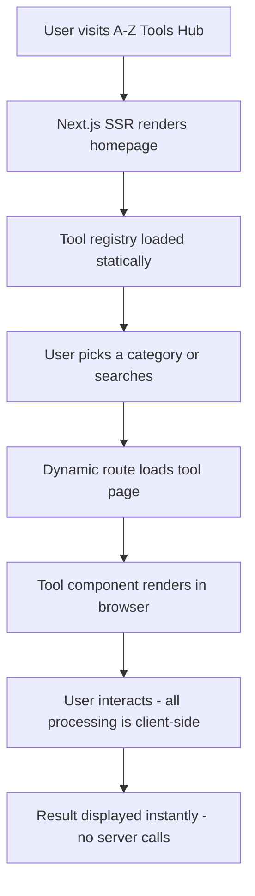
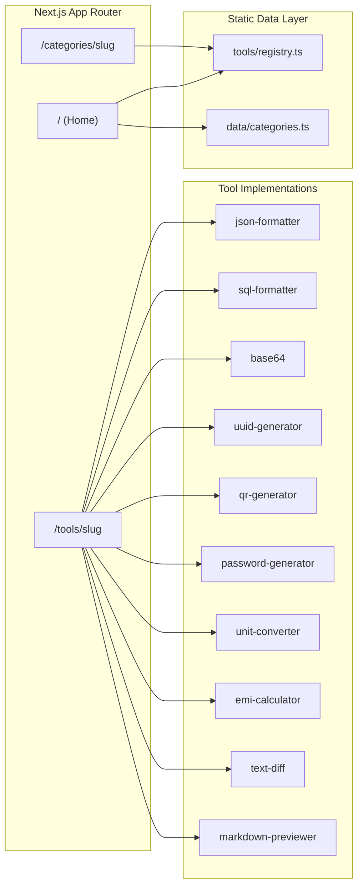

<div align="center">

# 🛠️ A-Z Tools Hub

**A free, fast, and privacy-first collection of everyday tools for developers, writers, and makers.**

[](LICENSE)
[](https://nextjs.org/)
[](https://www.typescriptlang.org/)
[](https://tailwindcss.com/)
[](https://github.com/xander1450/a2z/pulls)
[]()

> No sign-ups. No tracking. No nonsense. Just tools that work.

</div>

---

## 📖 What is A-Z Tools Hub?

**A-Z Tools Hub** is an open-source, browser-based productivity suite offering 10+ free utilities organised across 7 categories. Everything runs entirely in the browser — no data is ever sent to a server.

Whether you need to format a messy JSON blob, calculate your loan EMI, generate a QR code, or diff two blocks of text — A-Z Tools Hub has you covered.

---

## 🗂️ Tool Categories

| Category | Description | Tools |
|---|---|---|
| 🧑‍💻 **Developer Tools** | Formatters, encoders, and generators for programmers | JSON Formatter, SQL Formatter, Base64, UUID Generator |
| 🤖 **AI Tools** | AI-powered automation and smart text helpers | Coming soon |
| 📄 **PDF Tools** | PDF manipulation, converters, and utilities | Coming soon |
| 🖼️ **Image Tools** | Crop, compress, convert, and generate QR codes | QR Code Generator |
| ✍️ **Text Tools** | Case conversion, diff checking, and markup preview | Text Diff Checker, Markdown Previewer |
| 💰 **Finance Tools** | Loan and interest calculators with visual breakdowns | EMI Calculator |
| 🔧 **Utility Tools** | Passwords, clocks, converters, and randomizers | Password Generator, Unit Converter |

---

## 🧰 Available Tools

<details>
<summary><strong>🧑‍💻 Developer Tools</strong></summary>

- **JSON Formatter** – Format, validate, beautify, and minify JSON with syntax highlighting and instant error detection.
- **SQL Formatter** – Beautify and align SQL queries with support for uppercase keywords and custom spacing.
- **Base64 Encoder / Decoder** – Convert text to Base64 and decode Base64 strings back to readable text.
- **UUID Generator** – Bulk-generate cryptographically secure UUID v4s with hyphens and casing options.

</details>

<details>
<summary><strong>🖼️ Image Tools</strong></summary>

- **QR Code Generator** – Create high-resolution custom QR codes for URLs, text, and contacts. Download as PNG.

</details>

<details>
<summary><strong>✍️ Text Tools</strong></summary>

- **Text Diff Checker** – Compare two blocks of text side-by-side and highlight additions and deletions.
- **Markdown Previewer** – Write Markdown and see a live HTML preview rendered in real-time.

</details>

<details>
<summary><strong>💰 Finance Tools</strong></summary>

- **EMI Calculator** – Compute monthly loan instalments with visual interest-vs-principal breakdown charts.

</details>

<details>
<summary><strong>🔧 Utility Tools</strong></summary>

- **Password Generator** – Generate strong random passwords with configurable length, symbols, and strength meter.
- **Unit Converter** – Convert Length, Weight, Temperature, Area, and Volume in real-time.

</details>

---

## 📈 Application Flow



### Architecture Overview



---

## 🚀 Getting Started

### Prerequisites

- [Node.js](https://nodejs.org/) 20+
- npm / yarn / pnpm / bun

### Installation

```bash
# 1. Clone the repository
git clone https://github.com/xander1450/a2z.git
cd a2z

# 2. Install dependencies
npm install

# 3. Start the development server
npm run dev
```

Open [http://localhost:3000](http://localhost:3000) in your browser.

---

## 📦 Scripts

| Script | Command | Description |
|---|---|---|
| Dev server | `npm run dev` | Hot-reloading development server |
| Production build | `npm run build` | Compile and optimise for production |
| Production server | `npm run start` | Serve the production build |
| Lint | `npm run lint` | Run ESLint with Next.js rules |

---

## 🏗️ Project Structure

```
a2z/
├── app/                    # Next.js App Router pages
│   ├── categories/[slug]/  # Dynamic category listing pages
│   ├── tools/[slug]/       # Dynamic individual tool pages
│   ├── layout.tsx          # Root layout with metadata
│   └── page.tsx            # Homepage
├── components/             # Shared React components
├── data/
│   └── categories.ts       # Category metadata
├── tools/
│   ├── registry.ts         # Tool registry & search helpers
│   ├── json-formatter/     # JSON Formatter tool
│   ├── sql-formatter/      # SQL Formatter tool
│   ├── base64/             # Base64 Encoder/Decoder
│   ├── uuid-generator/     # UUID Generator
│   ├── qr-generator/       # QR Code Generator
│   ├── password-generator/ # Password Generator
│   ├── unit-converter/     # Unit Converter
│   ├── emi-calculator/     # EMI Calculator
│   ├── text-diff/          # Text Diff Checker
│   └── markdown-previewer/ # Markdown Previewer
├── lib/                    # Shared utilities
└── types/                  # TypeScript type definitions
```

---

## 🤝 Contributing

Contributions are welcome! To add a new tool:

1. **Fork** the repository and create a feature branch.
2. Add your tool component in `tools/<tool-slug>/`.
3. Register it in `tools/registry.ts` with metadata (name, slug, category, tags, SEO fields).
4. Open a **Pull Request** with a clear description.

---

## 🔒 Security

Found a vulnerability? Please read our [SECURITY.md](SECURITY.md) policy before disclosing.

---

## 📄 License

This project is licensed under the **MIT License** — see the [LICENSE](LICENSE) file for details.

Copyright © 2026 Aditya Narayan Verma

---

<div align="center">

Made with ❤️ by [Aditya Narayan Verma](https://github.com/xander1450)

⭐ Star this repo if you find it useful!

</div>
