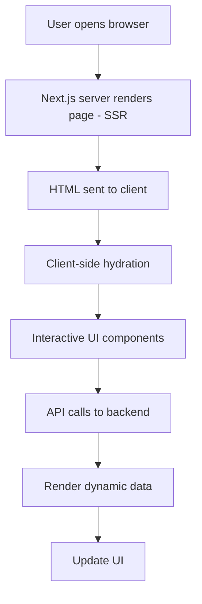

# A-Z Tools Hub

## 📈 Application Flow

The app follows a modern SSR + client‑side hydration pattern typical of Next.js 13. Below is a high‑level flow diagram illustrating the user experience from the moment a request hits the server to interactive UI updates.



[](https://opensource.org/licenses/MIT)
[](https://nextjs.org/)
[](https://nodejs.org/)
[](https://www.typescriptlang.org/)

A modern, production‑ready **Next.js 13** starter with **TypeScript**, **Tailwind CSS**, and **Radix UI**. It showcases best practices, performance optimizations, and a clean architecture to help you ship robust web applications fast.

---

## ✨ Features

- **Next.js 13 (App Router)** – File‑system routing, server components, and streaming.
- **TypeScript** – Strict typing for safer code.
- **Tailwind CSS** – Utility‑first styling with pre‑configured dark mode.
- **Radix UI Primitives** – Accessible, composable UI components.
- **Responsive Design** – Mobile‑first layout with modern CSS features (`container queries`, `:has()`).
- **SEO Ready** – Proper meta tags, Open Graph, and Twitter cards.
- **Linting & Formatting** – ESLint, Prettier, and TypeScript strict rules.
- **GitHub Actions CI** – Automated lint, type‑check, and build on push.

---

## 🚀 Getting Started

```bash
# Install dependencies (npm, yarn, pnpm, or bun)
npm install   # or yarn install, pnpm i, bun i

# Run the development server
npm run dev
```

## Deploy on Vercel

The easiest way to deploy your Next.js app is to use the [Vercel Platform](https://vercel.com/new?utm_medium=default-template&filter=next.js&utm_source=create-next-app&utm_campaign=create-next-app-readme) from the creators of Next.js.

Check out our [Next.js deployment documentation](https://nextjs.org/docs/app/building-your-application/deploying) for more details.
